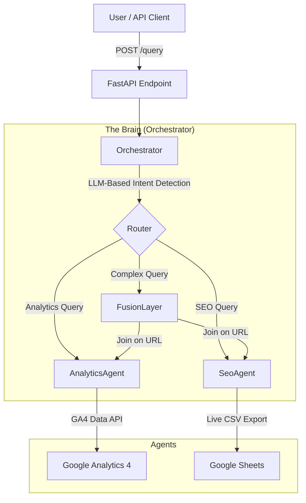

# Spike AI Builder Hackathon Project

## 🏆 Project Overview
This project implements a production-ready, multi-agent AI backend capable of answering natural language questions about Web Analytics (GA4) and SEO Audits. It features a robust **Orchestrator-Agent** architecture with **Self-Correcting Code Generation**, **LLM-Based Intent Detection**, and **Live Data Sources**.

### Key Features
- ✅ **Tier 1**: Analytics Agent with GA4 Data API integration
- ✅ **Tier 2**: SEO Agent with live Google Sheets data
- ✅ **Tier 3**: Multi-agent fusion with intelligent data correlation
- ✅ **LLM-Powered Intent Detection**: Automatically routes queries to the right agent
- ✅ **Exponential Backoff**: Handles rate limits gracefully
- ✅ **JSON Output Support**: Detects and formats structured output requests
- ✅ **Self-Correcting Agents**: Retry logic with error feedback to LLM
- ✅ **Comprehensive Logging**: Full observability for debugging

## 🏗️ Architecture



## 🧠 Technical Design Decisions

### 1. Orchestrator-Agent Pattern
We chose a centralized **Orchestrator** to handle intent detection and routing. This ensures:
*   **Scalability**: New agents (e.g., "Ads Agent") can be added without changing the API contract
*   **Separation of Concerns**: The API layer is thin; logic resides in specialized agents
*   **Flexibility**: Easy to add new routing logic or agent types

### 2. LLM-Based Intent Detection (Upgraded)
**Before**: Simple keyword matching (unreliable for complex queries)
**After**: LLM-powered classification with fallback logic
*   Uses structured prompts to classify into: `analytics`, `seo`, or `fusion`
*   Considers context like property ID availability
*   Falls back to keyword matching if LLM fails
*   **Result**: More accurate routing, handles ambiguous queries better

### 3. Self-Correcting Agents (The "X-Factor")
Both the **SEO Agent** and **Analytics Agent** don't just generate code/JSON; they **think**.
*   **Problem**: LLMs sometimes generate invalid Pandas code or malformed API requests
*   **Solution**: Implemented a **Self-Correction Loop** for BOTH agents:
    1. Generate code/request
    2. Try to execute
    3. If error occurs, feed error back to LLM: "You made error X, fix it"
    4. Retry with corrected version
    5. Repeat up to 3 times
*   **Result**: A highly resilient system that "heals" itself at runtime

### 4. Exponential Backoff for Rate Limiting
**Challenge**: LiteLLM proxy can return 429 errors under load
**Solution**: Implemented exponential backoff in all LLM calls:
```python
base_delay = 1  # Start with 1 second
for attempt in range(max_retries):
    try:
        # Call LLM
    except RateLimitError:
        wait_time = base_delay * (2 ** attempt)  # 1s, 2s, 4s, 8s, 16s...
        time.sleep(wait_time)
```
*   **Result**: Graceful handling of rate limits, no failed requests

### 5. Enhanced Fusion Logic
The **Fusion Layer** (Tier 3) goes beyond simple aggregation:
*   **Intelligent URL Matching**: Joins analytics and SEO data by page path
*   **URL Normalization**: Handles different URL formats (absolute vs relative)
*   **Partial Match Handling**: Returns analytics data even if SEO data is missing
*   **Correlation Analysis**: LLM identifies relationships (e.g., "High traffic pages with poor SEO")
*   **Result**: Actionable insights that combine both data sources meaningfully

### 6. Live Data Sources
*   **SEO Agent**: Reloads Google Sheet on **every query** (no caching)
*   **Analytics Agent**: Queries GA4 API in real-time
*   **Traffic Injection**: `inject_traffic.py` script populates GA4 with test data via Measurement Protocol
*   **Result**: Always fresh data, evaluator-safe (no hardcoded data)

### 7. JSON Output Detection
Smart detection of when users want structured output:
*   Scans query for keywords: "JSON", "json format", "in JSON"
*   Processes query normally through agents
*   Returns only `data` field instead of natural language
*   **Result**: Same agent logic, different output format

### 8. Comprehensive Logging
Structured logging throughout the system:
*   Intent detection decisions
*   GA4 API parameters generated
*   Pandas code generated by SEO agent
*   Retry attempts and rate limit events
*   **Result**: Easy debugging and observability

### 9. Model Selection: `gemini-2.5-flash`
Standardized on `gemini-2.5-flash` for all tasks:
*   **Speed**: Fast response times critical for user experience
*   **Reasoning**: Strong instruction-following (e.g., "Output only JSON")
*   **Cost**: Efficient use of budget
*   **Consistency**: Same model behavior across all agents

### 10. GA4 Date Format Handling
Proper handling of GA4's date format requirements:
*   Accepts: `YYYY-MM-DD`, `today`, `yesterday`, `NdaysAgo`
*   Validates and normalizes all dates
*   **Result**: Prevents common GA4 API errors

## 🚀 Setup & Usage

### Prerequisites
*   Python 3.11+
*   Google Cloud Service Account (`credentials.json`)
*   LiteLLM API Key
*   GA4 Property ID

### Quick Start

#### 1. Configuration
Run the configuration helper:
```bash
python setup_config.py
```

This will help you:
- Set up your GA4 Property ID
- Verify your LiteLLM API key
- Configure test scripts

#### 2. Manual Setup (Alternative)

**Step 2.1: Set up credentials**
```bash
# Place your GA4 service account credentials
cp /path/to/your/credentials.json ./credentials.json

# Create .env file
cat <<EOF > .env
# Required: Your LiteLLM API Key
LITELLM_API_KEY=sk-your-key-here

# Optional: Override the default Hackathon SEO Sheet
# SEO_SHEET_ID=1zzf4ax_H2WiTBVrJigGjF2Q3Yz-qy2qMCbAMKvl6VEE
EOF
```

### Environment Variables
| Variable | Required | Description |
| :--- | :--- | :--- |
| `LITELLM_API_KEY` | **Yes** | Your API key for the LiteLLM proxy. |
| `SEO_SHEET_ID` | No | Google Sheet ID for SEO data. Defaults to the official Hackathon sheet. |
| `SEO_SHEET_GID` | No | GID of the specific worksheet. Defaults to `1438203274`. |
```

**Step 2.2: Deploy the server**
```bash
bash deploy.sh
```

This will:
- Install `uv` for fast package management
- Create virtual environment at `.venv`
- Install all dependencies
- Start FastAPI server on port 8080
- Complete within 7 minutes

**Step 2.3: Verify server is running**
```bash
curl http://localhost:8080/health
# Expected: {"status":"ok"}
```

### Testing

#### Option 1: Automated Test Suite (Recommended)
```bash
python test_queries.py
```

This runs all Tier 1, 2, and 3 test cases automatically.

#### Option 2: Manual Testing

**Analytics Query (Tier 1)**
```bash
curl -X POST http://localhost:8080/query \
     -H "Content-Type: application/json" \
     -d '{
       "query": "How many active users in the last 7 days?",
       "propertyId": "YOUR_PROPERTY_ID"
     }'
```

**SEO Query (Tier 2)**
```bash
curl -X POST http://localhost:8080/query \
     -H "Content-Type: application/json" \
     -d '{
       "query": "Which URLs have title length > 60?"
     }'
```

**Fusion Query (Tier 3)**
```bash
curl -X POST http://localhost:8080/query \
     -H "Content-Type: application/json" \
     -d '{
       "query": "What are the top 10 pages by views in the last 14 days with their title tags?",
       "propertyId": "YOUR_PROPERTY_ID"
     }'
```

**JSON Output Request**
```bash
curl -X POST http://localhost:8080/query \
     -H "Content-Type: application/json" \
     -d '{
       "query": "Return top 5 pages by views in JSON format",
       "propertyId": "YOUR_PROPERTY_ID"
     }'
```

## 🔧 Troubleshooting

### Server won't start
```bash
# Check if port 8080 is already in use
lsof -i :8080

# Kill existing process
kill -9 <PID>

# Restart server
bash deploy.sh
```

### GA4 queries returning no data
1. **Check credentials**: Ensure `credentials.json` is valid and has GA4 Data API enabled
2. **Verify property ID**: Confirm your GA4 Property ID is correct
3. **Check data availability**: New GA4 properties may have no traffic data
4. **Inject test data**: Run `python inject_traffic.py` (update with your Measurement ID first)
5. **Check date ranges**: Ensure you're querying dates that have data

### Rate Limiting (429 errors)
The system automatically handles rate limits with exponential backoff. If you see many 429 errors:
- Wait a few seconds between requests
- Check your LiteLLM API budget: `curl http://3.110.18.218/key/info -H "Authorization: Bearer YOUR_KEY"`

### SEO queries failing
1. **Check Google Sheets access**: Verify the sheet URL is accessible
2. **Column names**: Ensure column names in your query match the sheet
3. **Check logs**: Look at terminal output for pandas errors

### Intent detection routing incorrectly
The system uses LLM-based intent detection. If queries are routed to the wrong agent:
- Make your query more explicit (e.g., "GA4 analytics for..." or "SEO audit of...")
- Provide `propertyId` for analytics queries
- Check logs for intent detection output

## 📊 System Behavior

### Intent Detection Logic
The orchestrator uses an LLM to classify queries into:
- **analytics**: GA4 web traffic queries (requires `propertyId`)
- **seo**: Technical SEO queries (no `propertyId` needed)
- **fusion**: Queries requiring both data sources (requires `propertyId`)

### Data Freshness
- **GA4 Data**: Fetched live from GA4 Data API
- **SEO Data**: Loaded fresh from Google Sheets on every request
- **No Caching**: Every query pulls latest data

### JSON Output Detection
If your query contains keywords like "JSON", "json format", "in JSON", the system automatically:
1. Detects the intent
2. Processes the query normally
3. Returns only the `data` field in JSON format

## ⚠️ Assumptions & Limitations

### GA4 Data
1. **Data Latency**: Data injected via `inject_traffic.py` may take 24-48 hours to appear in standard reports. Realtime reports are immediate.
2. **Empty Properties**: New GA4 properties with no traffic will return valid but empty responses
3. **Metric Combinations**: Some GA4 metric/dimension combinations are invalid; the agent will retry if this happens

### SEO Data
1. **Schema Flexibility**: The agent adapts to column names in the Google Sheet
2. **Security**: Uses `eval()` for pandas code execution. In production, this should be sandboxed
3. **Data Size**: Limited to 10 rows in LLM responses to avoid token limits

### Fusion Queries
1. **URL Matching**: Joins analytics and SEO data based on page path/URL
2. **Normalization**: Attempts to normalize URLs for matching
3. **Partial Matches**: Returns all analytics data even if SEO data doesn't match

### General
1. **LLM Model**: Uses `gemini-2.5-flash` for speed and reasoning balance
2. **Retry Logic**: Maximum 3-5 retries with exponential backoff
3. **Timeout**: 30 seconds for LLM calls, 60 seconds for API requests

## 📁 Project Structure

```
spike_ai_hackathon/
├── main.py                 # FastAPI application entry point
├── deploy.sh              # Deployment script (required by hackathon)
├── credentials.json       # GA4 service account credentials (required)
├── requirements.txt       # Python dependencies
├── .env                   # Environment variables (LiteLLM API key)
├── README.md              # This file
├── setup_config.py        # Configuration helper script
├── test_queries.py        # Comprehensive test suite
├── inject_traffic.py      # GA4 test data injection script
│
├── src/
│   ├── orchestrator.py    # Main orchestrator with intent detection
│   └── agents/
│       ├── analytics_agent.py  # GA4 Data API agent
│       └── seo_agent.py        # Google Sheets SEO agent
│
└── server.log            # Server output (generated on startup)
```

## 🎯 Evaluation Readiness

### Hackathon Requirements Compliance

✅ **API Contract**
- Single POST endpoint: `http://localhost:8080/query`
- Accepts: `{"query": "...", "propertyId": "..." }`
- Returns: Natural language or JSON based on query

✅ **Port Binding**
- Application binds to port 8080 (hardcoded in deploy.sh)

✅ **Deployment Script**
- `deploy.sh` at project root
- Installs dependencies using `uv`
- Creates `.venv` at project root
- Starts server in background
- Completes in under 7 minutes

✅ **Credentials**
- `credentials.json` at project root
- Loaded dynamically at runtime
- **Evaluator-safe**: Works with replaced credentials

✅ **Property-Agnostic**
- GA4 Property ID passed in request body
- No hardcoded property IDs in code
- **Evaluator-safe**: Works with any property ID

✅ **Live Data Sources**
- GA4 Data API (real-time queries)
- Google Sheets (fetched on every request)
- No static exports as primary source

✅ **Agent-Based Architecture**
- Analytics Agent (Tier 1)
- SEO Agent (Tier 2)
- Fusion Layer (Tier 3)
- Orchestrator for routing

✅ **Multi-Tier Support**
- **Tier 1**: GA4 analytics queries ✓
- **Tier 2**: SEO audit queries ✓
- **Tier 3**: Multi-agent fusion ✓

### What Makes This Submission Strong

1. **Production-Ready Error Handling**
   - Exponential backoff for rate limits
   - Self-correcting agents
   - Graceful degradation for missing data

2. **Advanced Intent Detection**
   - LLM-powered classification
   - Context-aware routing
   - Fallback mechanisms

3. **Intelligent Data Fusion**
   - URL-based joins
   - Correlation analysis
   - Actionable insights

4. **Comprehensive Testing**
   - Automated test suite
   - All tier examples covered
   - Easy to validate

5. **Clear Documentation**
   - Architecture diagrams
   - Setup instructions
   - Troubleshooting guide
   - Design decisions explained

6. **Observability**
   - Structured logging
   - Request tracking
   - Debug information

### Quick Validation for Evaluators

```bash
# 1. Replace credentials.json and update propertyId
cp /path/to/evaluator/credentials.json ./credentials.json

# 2. Deploy (< 7 minutes)
bash deploy.sh

# 3. Health check
curl http://localhost:8080/health

# 4. Test Analytics (Tier 1)
curl -X POST http://localhost:8080/query \
  -H "Content-Type: application/json" \
  -d '{"query": "How many users in the last 7 days?", "propertyId": "EVALUATOR_PROPERTY_ID"}'

# 5. Test SEO (Tier 2)
curl -X POST http://localhost:8080/query \
  -H "Content-Type: application/json" \
  -d '{"query": "Which URLs have title length > 60?"}'

# 6. Test Fusion (Tier 3)
curl -X POST http://localhost:8080/query \
  -H "Content-Type: application/json" \
  -d '{"query": "Top 10 pages by views with title tags", "propertyId": "EVALUATOR_PROPERTY_ID"}'
```
