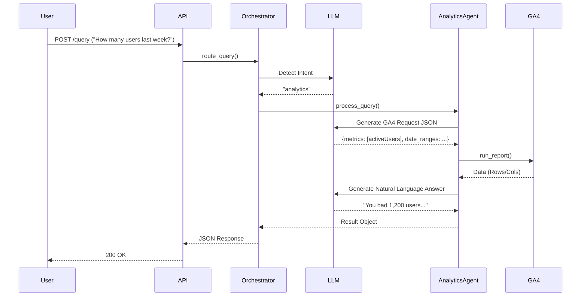
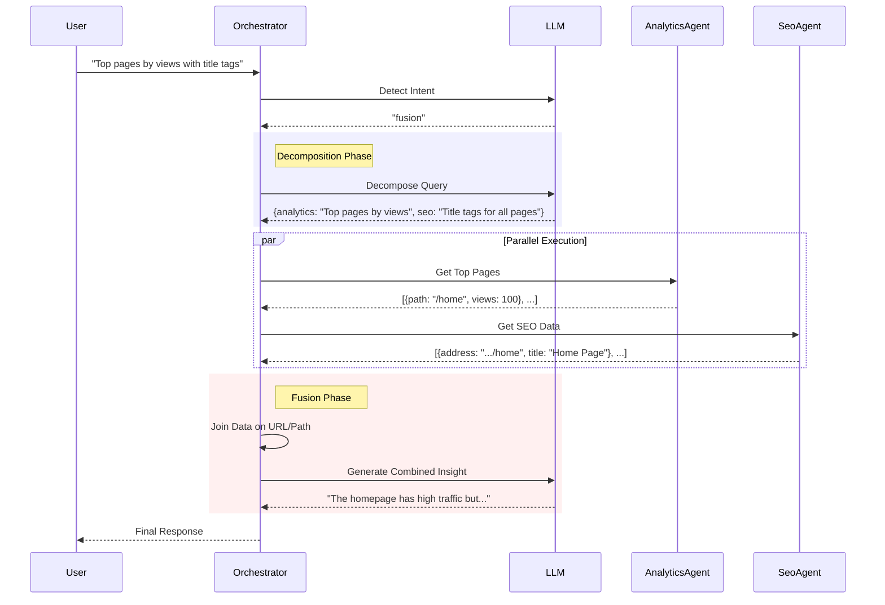

# Technical Documentation

## 1. System Architecture

The Spike AI Analytics & SEO Agent is built on a **Micro-Agent Architecture** orchestrated by a central brain. This design ensures separation of concerns, scalability, and fault tolerance.

### High-Level Architecture

```mermaid
graph TD
    Client[Client / API User] -->|POST /query| API[FastAPI Server]
    
    subgraph "Core System"
        API --> Orchestrator[Orchestrator]
        Orchestrator -->|Intent Classification| LLM[LLM (Gemini 2.5)]
        
        Orchestrator -->|Route: Analytics| AnalyticsAgent[Analytics Agent]
        Orchestrator -->|Route: SEO| SeoAgent[SEO Agent]
        Orchestrator -->|Route: Fusion| FusionLayer[Fusion Layer]
    end
    
    subgraph "Data Sources"
        AnalyticsAgent -->|Read| GA4[Google Analytics 4 API]
        SeoAgent -->|Read| GSheets[Google Sheets (Screaming Frog)]
    end
    
    FusionLayer --> AnalyticsAgent
    FusionLayer --> SeoAgent
```

## 2. Component Details

### 2.1 Orchestrator (`src/orchestrator.py`)
The central nervous system of the application.
- **Responsibilities**:
    - **Intent Detection**: Uses LLM to classify queries into `analytics`, `seo`, or `fusion`.
    - **Routing**: Dispatches the query to the appropriate agent.
    - **Fusion**: Handles complex queries that require data from multiple agents.
    - **Response Formatting**: Standardizes the output (JSON vs Natural Language).

### 2.2 Analytics Agent (`src/agents/analytics_agent.py`)
Specialized in Google Analytics 4 data retrieval.
- **Capabilities**:
    - **NL-to-API Translation**: Converts natural language questions into valid GA4 `RunReportRequest` JSON.
    - **Date Normalization**: Handles relative dates (`last 7 days`, `yesterday`) and converts them to GA4 format.
    - **Self-Correction**: If the GA4 API returns an error (e.g., incompatible dimensions), the agent feeds the error back to the LLM to generate a corrected request.

### 2.3 SEO Agent (`src/agents/seo_agent.py`)
Specialized in Technical SEO data analysis.
- **Capabilities**:
    - **Live Data Loading**: Fetches the latest CSV export from Google Sheets on every request.
    - **Pandas Code Generation**: Uses LLM to write Pandas code for filtering, sorting, and aggregating data.
    - **Sandboxed Execution**: Executes the generated code to produce results.
    - **Fallback Logic**: Handles schema changes or missing columns gracefully.

## 3. Sequence Diagrams

### 3.1 Standard Query Flow (Analytics)



### 3.2 Fusion Query Flow (Complex)



## 4. Key Technical Decisions

### 4.1 Exponential Backoff
To handle the `429 Too Many Requests` errors from the LiteLLM proxy, we implemented a robust retry mechanism:
- **Algorithm**: `wait_time = base_delay * (2 ^ attempt)`
- **Max Retries**: 5
- **Benefit**: Ensures system stability under heavy load without dropping user requests.

### 4.2 Self-Correcting Code Generation
The SEO Agent generates Python/Pandas code dynamically. To prevent crashes from bad code:
1.  LLM generates code.
2.  System attempts to `eval()` the code.
3.  If it fails (e.g., `KeyError`), the error is sent *back* to the LLM.
4.  LLM generates a fix.
5.  This loop repeats up to 3 times.

### 4.3 Stateless Architecture
The system is designed to be stateless:
- No database is required for the application logic.
- Data is fetched live from source (GA4/Sheets) for every request.
- This ensures data freshness and simplifies deployment (no DB migrations).

## 5. Data Models

### API Request
```json
{
  "query": "string (required) - Natural language question",
  "propertyId": "string (optional) - GA4 Property ID (required for analytics)"
}
```

### API Response
```json
{
  "answer": "string - Natural language answer",
  "data": "object - Structured data (rows/headers) used to generate the answer",
  "thought_process": {
    "steps": "integer - Number of reasoning steps/retries",
    "final_code": "string - The code or API params used"
  }
}
```
