# 📑 Spike AI: Autonomous Analytics & SEO Agent
> **Technical Whitepaper & Architecture Reference**  
> **Version**: 2.0.0  
> **Date**: December 2025

---

## 1. Executive Summary

In the modern digital landscape, data is fragmented across silos—traffic data in Google Analytics, technical health in SEO crawlers, and business logic in spreadsheets. **Spike AI** bridges these gaps by providing a unified, natural-language interface that acts as an autonomous data analyst.

Unlike traditional dashboards that display static charts, Spike AI uses a **Micro-Agent Architecture** to understand intent, write its own code to query data, and fuse results from disparate sources into actionable insights. This document outlines the technical architecture, key innovations, and security measures that make Spike AI a robust enterprise-grade solution.

---

## 2. System Architecture

The system is built on a **Hub-and-Spoke** pattern, ensuring modularity and scalability. The central `Orchestrator` manages state and routing, while specialized agents handle domain-specific logic.

### 2.1 High-Level Architecture


---

## 3. Core Innovations

### 3.1 Dynamic Code Synthesis (The "Infinite Query" Engine)
Traditional analytics tools rely on pre-defined reports. Spike AI overcomes this limitation by **writing its own code** at runtime.

*   **Problem**: Users ask questions that no pre-built dashboard can answer (e.g., *"Show me URLs with >500 views but missing title tags"*).
*   **Solution**: The **SEO Agent** uses an LLM to generate `pandas` code on the fly.
*   **Safety Mechanism**: The system implements a **Self-Correction Loop**. If the generated code fails (e.g., syntax error), the error is fed back to the LLM to generate a fix, up to 3 times.

```mermaid
sequenceDiagram
    participant Agent as SEO Agent
    participant LLM
    participant Runtime as Python Runtime

    Agent->>LLM: "Generate pandas code for query"
    LLM-->>Agent: Code (Draft 1)
    
    Agent->>Runtime: Execute(Draft 1)
    Runtime-->>Agent: ❌ Error: "KeyError: 'Url'"
    
    Note right of Agent: Self-Healing Triggered
    
    Agent->>LLM: "Fix code: KeyError 'Url'"
    LLM-->>Agent: Code (Draft 2)
    
    Agent->>Runtime: Execute(Draft 2)
    Runtime-->>Agent: ✅ Success
```



### 3.2 Multi-Modal Data Fusion
Spike AI solves the "Data Silo" problem by joining data across different formats and sources.

*   **Source A**: GA4 (JSON API, dynamic metrics).
*   **Source B**: Screaming Frog (CSV export, static attributes).
*   **Fusion Logic**: The `FusionLayer` normalizes URLs (stripping query parameters and protocols) to create a common join key, allowing seamless cross-referencing of traffic data with technical SEO health.

### 3.3 Resilient Orchestration
To ensure reliability in a hackathon/demo environment:
*   **Exponential Backoff**: Handles `429 Too Many Requests` from LLM providers by waiting `1s, 2s, 4s, 8s` between retries.
*   **Smart Timeouts**: API timeouts are tuned to **120 seconds** to allow for complex multi-step reasoning without hanging the client.

---

## 4. Component Deep Dive

### 4.1 The Orchestrator (`src/orchestrator.py`)
*   **Role**: Traffic Controller.
*   **Logic**: Uses a specialized LLM prompt to classify user intent into `analytics`, `seo`, or `fusion`.
*   **Fallback**: If LLM classification fails, it falls back to keyword-based heuristic routing.

### 4.2 Analytics Agent (`src/agents/analytics_agent.py`)
*   **Role**: GA4 Specialist.
*   **Feature**: **Natural Language Date Parsing**. Converts "last week" or "Q3" into precise `YYYY-MM-DD` ranges required by the GA4 API.

### 4.3 SEO Agent (`src/agents/seo_agent.py`)
*   **Role**: Data Scientist.
*   **Feature**: **Live Data Loading**. Fetches the latest data from Google Sheets on *every* request, ensuring decisions are never made on stale data.

---

## 5. Security & Deployment

### 5.1 Zero-Trust Credential Management
*   **No Hardcoded Secrets**: API keys and credentials are strictly loaded from environment variables or ignored local files.
*   **Git-Safe**: `.gitignore` is pre-configured to block `credentials.json`, `.env`, and `*.log`.

### 5.2 High-Performance Stack
*   **Runtime**: Python 3.11+
*   **Web Server**: `uvicorn` (ASGI) for asynchronous request handling.
*   **Package Manager**: `uv` (Rust-based) for instant dependency resolution and setup.

---

## 6. Project Structure

```text
spike-ai-analytics-seo-agent/
├── src/
│   ├── agents/
│   │   ├── analytics_agent.py  # GA4 Logic
│   │   └── seo_agent.py        # Pandas/CSV Logic
│   └── orchestrator.py         # Routing & Fusion
├── main.py                     # FastAPI Entrypoint
├── deploy.sh                   # One-click deployment
├── requirements.txt            # Dependencies
├── README.md                   # User Guide
└── TECHNICAL_DOCUMENTATION.md  # This File
```

---

## 7. Future Roadmap

*   **Predictive Analytics**: Integrate Prophet/ARIMA models to forecast future traffic trends.
*   **Voice Interface**: Add Speech-to-Text for a fully hands-free analyst experience.
*   **Active SEO Fixes**: Allow the agent to not just *find* issues, but *fix* them (e.g., generating meta tags and pushing to CMS).

---
> *Built with ❤️ for the Spike AI Hackathon*
