# 📘 Technical Documentation
> **Project**: Spike AI Analytics & SEO Agent  
> **Version**: 2.0.0  
> **Architecture**: Micro-Agent / Orchestrator Pattern

---

## 1. Executive Summary
The **Spike AI Analytics & SEO Agent** is an intelligent, natural-language interface for web analytics and technical SEO. It abstracts the complexity of GA4 APIs and SEO datasets behind a conversational AI layer, allowing users to ask questions like *"How did my traffic compare to last week?"* or *"Which pages have missing title tags?"* and receive instant, data-backed answers.

### Key Features
*   **🧠 Intelligent Intent Detection**: Automatically routes queries to the correct specialized agent (Analytics, SEO, or Fusion).
*   **🔌 Plug-and-Play Architecture**: Designed for easy deployment with standard Google Service Accounts and LiteLLM.
*   **🛡️ Self-Healing Code Execution**: The SEO agent writes, executes, and *fixes* its own Pandas code to answer complex data questions.
*   **⚡ High-Performance**: Built on **FastAPI** and **uv**, ensuring sub-second routing and rapid response times.

---

## 2. System Architecture

The system follows a **Hub-and-Spoke** design where the `Orchestrator` acts as the central hub, managing communication between the user and specialized domain agents.

### High-Level Diagram

```mermaid
graph TD
    Client[User / Client App] -->|HTTP POST /query| API[FastAPI Gateway]
    
    subgraph "🧠 Core Intelligence"
        API --> Orch[Orchestrator]
        Orch -->|Classify Intent| LLM[LLM (Gemini 2.5)]
        
        Orch -->|Route| AA[Analytics Agent]
        Orch -->|Route| SA[SEO Agent]
        Orch -->|Route| FL[Fusion Layer]
    end
    
    subgraph "💾 Data Layer"
        AA <-->|JSON API| GA4[Google Analytics 4]
        SA <-->|CSV Stream| GSheets[Screaming Frog Data]
    end
    
    FL -.->|Combine| AA
    FL -.->|Combine| SA
```

---

## 3. Component Deep Dive

### 3.1 The Orchestrator (`src/orchestrator.py`)
The "Brain" of the operation. It does not process data itself but manages the workflow:
1.  **Intent Classification**: Uses LLM to determine if the user needs Analytics, SEO, or both.
2.  **Query Decomposition**: For "Fusion" queries, it breaks the request into sub-tasks (e.g., *"Get top pages"* + *"Get title tags"*).
3.  **Data Fusion**: Intelligently joins disparate datasets (GA4 JSON + SEO CSV) based on URL normalization logic.

### 3.2 Analytics Agent (`src/agents/analytics_agent.py`)
A wrapper around the complex **Google Analytics Data API (v1beta)**.
*   **Smart Date Parsing**: Understands relative dates like "last 30 days", "yesterday", or "Q1 2024".
*   **Metric Validation**: Ensures requested metrics (e.g., `activeUsers`) are compatible with dimensions (e.g., `pagePath`) before calling the API.
*   **Error Recovery**: If GA4 returns a `400 Bad Request`, the agent feeds the error back to the LLM to regenerate valid parameters.

### 3.3 SEO Agent (`src/agents/seo_agent.py`)
A dynamic data analyst for Technical SEO.
*   **Live Data**: Fetches the latest export from Google Sheets on *every request*, ensuring real-time accuracy.
*   **Sandboxed Code Gen**: Instead of hardcoded logic, it generates **Pandas** code on the fly to answer any question about the data structure.
*   **Retry Mechanism**: Implements a 3-stage retry loop. If the generated code fails (e.g., `SyntaxError`), it self-corrects.

---

## 4. Sequence Flows

### 4.1 The "Self-Correction" Loop (SEO Agent)
This diagram illustrates how the system handles errors autonomously.

```mermaid
sequenceDiagram
    participant Agent as SEO Agent
    participant LLM
    participant Runtime as Python Runtime

    Agent->>LLM: "Write pandas code to find non-HTTPS URLs"
    LLM-->>Agent: Code (Draft 1)
    
    Agent->>Runtime: exec(Draft 1)
    Runtime-->>Agent: ❌ Error: "Column 'Url' not found"
    
    Note right of Agent: Self-Correction Triggered
    
    Agent->>LLM: "Code failed with 'Column not found'. Fix it."
    LLM-->>Agent: Code (Draft 2 - Corrected)
    
    Agent->>Runtime: exec(Draft 2)
    Runtime-->>Agent: ✅ Result DataFrame
    
    Agent->>Agent: Format Response
```



---

## 5. Security & Deployment

### 5.1 Credential Management
*   **Zero-Trust Storage**: Sensitive keys (`credentials.json`, `.env`) are **never** committed to version control.
*   **Environment Injection**: The system supports injecting secrets via environment variables for CI/CD pipelines.
*   **Safe Defaults**: The repository includes `credentials.example.json` and a default `SEO_SHEET_ID` to allow immediate testing by evaluators without configuration.

### 5.2 Rate Limiting Strategy
To ensure stability during the hackathon evaluation:
*   **Exponential Backoff**: All LLM calls implement `wait_time = 1s * (2^retry)`.
*   **Timeout Management**: API timeouts are set to **120 seconds** to accommodate complex reasoning chains.

---

## 6. API Reference

### Endpoint: `POST /query`

**Request Headers**:
`Content-Type: application/json`

**Request Body**:
```json
{
  "query": "What are my top 5 pages by bounce rate?",
  "propertyId": "123456789" // Required for Analytics/Fusion
}
```

**Response Body**:
```json
{
  "answer": "Your top page by bounce rate is /blog/hello-world with 85%...",
  "data": {
    "headers": ["pagePath", "bounceRate"],
    "rows": [
      {"pagePath": "/blog/hello-world", "bounceRate": "0.85"}
    ]
  },
  "thought_process": {
    "steps": 1,
    "final_params": "{...}"
  }
}
```
